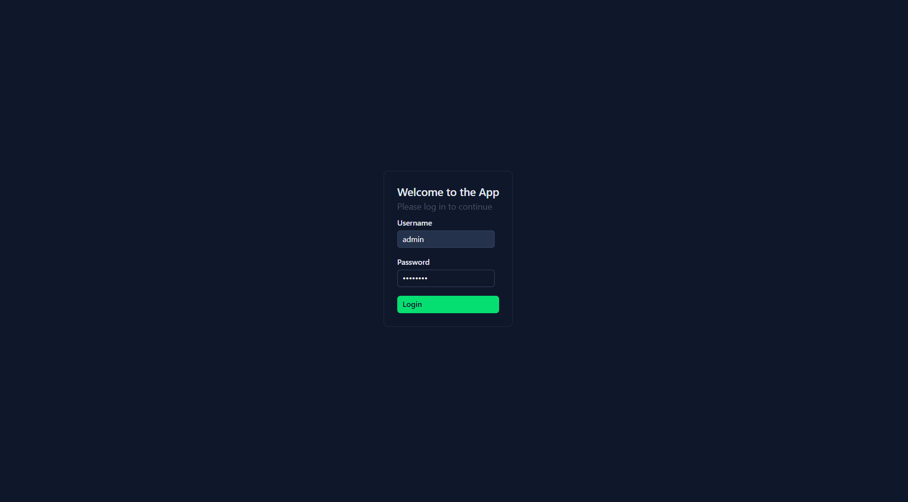
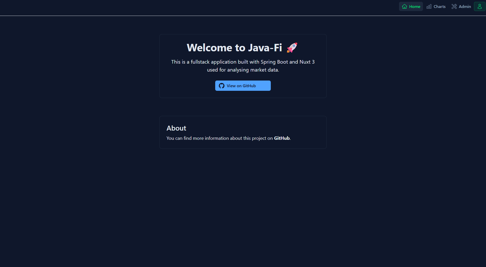
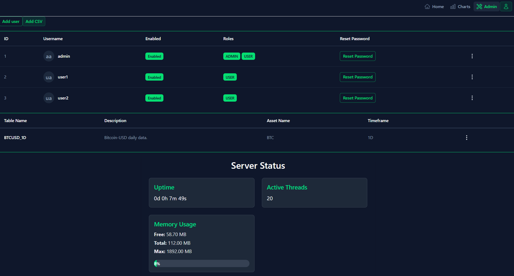
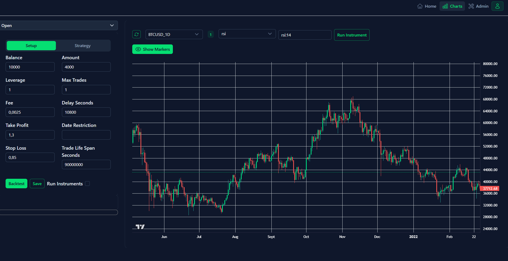
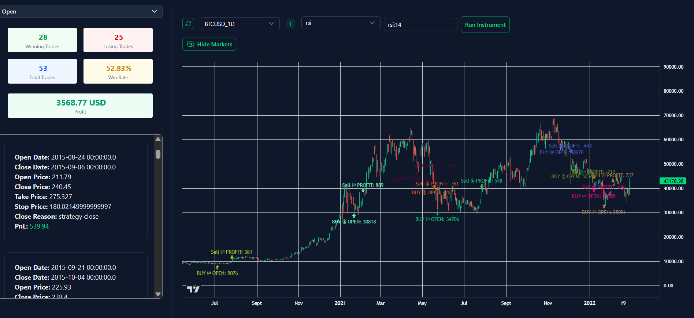

# Frontend

## Description

This is the frontend part of the Java FI Fullstack application, built with Nuxt.js. It provides a user interface for interacting with the backend services.

### Structure

The application is structured as ordinary Nuxt.js project: ./pages contains the pages, ./components contains reusable components, and ./app/assets/css contains global styles.

---

## Run

### Docker
```shell
docker build -t java-fi-frontend . 
docker run -p 3001:80 java-fi-frontend 
# Adjust port if needed (Grafana default is 3000)
```

### Without Docker

```shell
npm install
npm run dev
```

### Port Configuration

You can define the ports in `.env` file:
```env
PORT=3005
BACKEND_BASE=http://localhost:8080
```
- Where `PORT` is the port for the Nuxt application.
- `BACKEND_BASE` is the base URL for the backend API.

---

## How to use

- After you started both backend and frontend, you can access the frontend at `http://localhost:3001` (or the port you defined in `.env` or docker).

- You will see the login page. You can use the following credentials to log in:
  - Username: `admin`
  - Password: `password`

   

- After successful login, you will be redirected to the home page (eg `http://localhost:3001/`).

- If you are logged in as an admin, you will also see the admin options in the navigation bar.
- You can logout by clicking the profile icon in the top right corner and selecting "Logout". There you can also see your username.

### Pages

- **Home Page (/)**: Displays the information about the application and the link to the github repository.
- **Admin Page (/admin)**: A special page for admin users to manage the application and its data. It allows you to:

    

    - Add/Delete/Clean (removing columns for instruments and strategies) a table (csv).
    - Add/Delete/Enable/Disable (disabled users cannot login) a user.
    - Reset user's password.

- **Charts Page (/charts)**: Displays available charts and contains backtesting functionality.

    

### Backtesting

- To run a backtest, you need to have all the instruments which are used in the strategy already calculated. You can do that either by `Run Instrument` button in the charts page or by checking `Run Instruments` in the backtesting form. This option will run all the instruments which are used in the strategy before running the backtest.

- A successful execution of the backtest should look like this: 

    

#### Backtesting Setup

- **Balance**: The initial balance for the backtest.
- **Amount**: The amount of the instrument to buy/sell.
- **Leverage**: The leverage to use for the backtest.
- **Max Trades**: The maximum number of trades to be opened at the same time.
- **Fee**: The fee to be applied to the trades.
- **Delay Seconds**: The delay in seconds between the trades.
- **Take Profit**: The multiplier of the trade entry price to set the take profit.
- **Stop Loss**: The multiplier of the trade entry price to set the stop loss.
- **Date Restriction**: The date range for the backtest. If not set, the backtest will run for all available data.
    - It shall be a SQL query in format: `WHERE DATE BETWEEN '2023-01-01' AND '2023-12-31'` 
- **Trade Life Span Seconds**: The lifespan of the trade in seconds. If not set, the trade will be closed at the end of the backtest.

#### Backtesting Strategy

- **Open Clause** 
    - The condition to open a trade. It shall be a SQL query in format: `WHERE <condition>` eg `WHERE rsi:14 <= 30`.
    - You can also use Select Menu to choose instruments for the strategy. After you fill the values for the instruments then the query will be generated automatically.
- **Close Clause**
    - Works same as Open Clause, but for closing the trade.
- **Stop Loss Enabled**: If checked, the stop loss will be applied to the trade.
- **Take Profit Enabled**: If checked, the take profit will be applied to the trade.

---